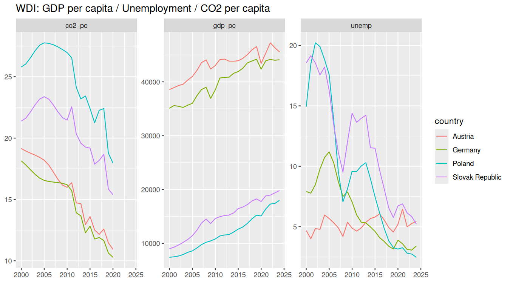

# ESG Starter (R, WDI) — EU/CEE

A small, reproducible R project that:
- downloads open **World Bank (WDI)** indicators for several EU/CEE countries,
- automatically picks an available **E-metric** (PM2.5 / CO₂ per capita / Energy use),
- produces basic plots and a simple OLS regression,
- ships with a mini **Shiny** dashboard.

## Data (WDI indicators)
- **GDP per capita (constant $)** — `NY.GDP.PCAP.KD`  
- **Unemployment, %** — `SL.UEM.TOTL.ZS`  
- **E-metric** (auto-selected; the chosen source is written to `data/e_metric_source.txt`):
  1) `EN.ATM.CO2E.PC` (CO₂ per capita), or  
  2) `EN.ATM.CO2E.KT` + `SP.POP.TOTL` → computed CO₂ per capita, or  
  3) `EN.ATM.PM25.MC.M3` (PM2.5), or  
  4) `EG.USE.PCAP.KG.OE` (energy use per capita).  

> For compatibility, the column is always named `co2_pc` (even when it stores PM2.5 or energy use).

## Quick start
~~~r
# Install once
install.packages(c("WDI","dplyr","readr","ggplot2","tidyr","shiny","bslib"))

# 1) Download data
source("R/01_get_data.R")     # -> data/wdi_eu.csv (+ e_metric_source.txt)

# 2) Make plots
source("R/03_plots.R")        # -> results/p1_trends.png (+ p2_scatter.png)

# 3) Run a simple regression (OLS)
source("R/02_analysis.R")     # -> results/model_summary.txt, latest_by_country.csv

# 4) Launch the Shiny dashboard
shiny::runApp("app")
~~~

## Project structure
~~~
esg-starter-r
├── README.md
├── R/
│   ├── 01_get_data.R      # WDI download, robust E-metric selection
│   ├── 02_analysis.R      # simple OLS
│   └── 03_plots.R         # plots and PNG export
├── app/
│   └── app.R              # Shiny app (robust path to data/, latest-available-year scatter)
├── data/                  # (generated) wdi_eu.csv, e_metric_source.txt
└── results/               # (generated) p1_trends.png, p2_scatter.png, tables
~~~

## Requirements
R ≥ 4.x and packages: `WDI`, `dplyr`, `readr`, `ggplot2`, `tidyr`, `shiny`, `bslib`.  
On Windows, the **Rtools** warning can be ignored if binary packages install successfully.

## Notes
- `data/` and `results/` are in `.gitignore` so the repo stays lightweight.  
  If you want to embed an image in this README, temporarily remove `results/` from `.gitignore` and commit the PNG.
- The Shiny scatter uses the **latest available year** per country to avoid gaps.

## Roadmap (nice-to-have)
- EU choropleth map (`sf` + `rnaturalearth`).
- ETF returns vs ESG macro model.
- R Markdown report (methods & results).
- Reproducibility via `renv` + CI (GitHub Actions).

## Preview

